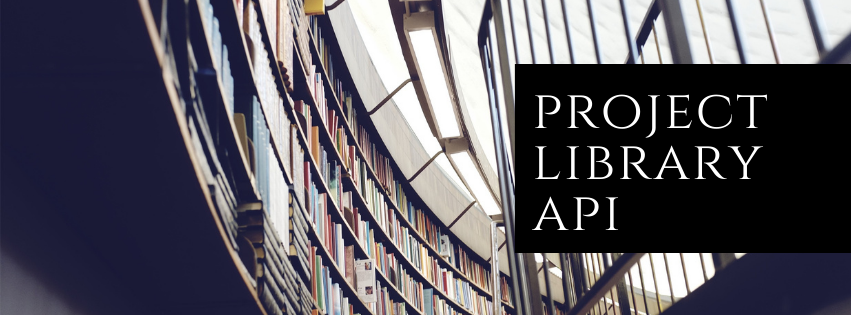

## :books: Descrição

Com o intuito de reforçar, aprender e aperfeiçoar boas práticas, resolvi fazer o curso do professor [Dougllas Souza](https://www.linkedin.com/in/dougllasfps/) criando uma api durante o curso com Spring Boot. Esse projeto simula uma biblioteca onde foi adquiridos conhecimentos sobre:

- Aprender um pouco sobre as  técnicas TDD e BDD
- modelar uma API RestFUL, utilizar os métodos HTTP, códigos de resposta, etc.;

- Criar serviço de agendamento de tarefas e envio de emails com o Java;

- Documentação de API's com Swagger

- Implementação de testes automatizados;

- Configuração de Deploy Contínuo;

- Publicação da API na nuvem.

## :sparkles: Funcionalidades

 > **Foi feito um CRUD para poder manipular os livros da biblioteca.**

####  📚 Livros  📚
<details>
  <summary><strong>🟢Criar livros na biblioteca. </strong></summary><br />

 > POST - /api/books

JSON:
```
{
  "author": "Robert C. Martin",
  "isbn": "ISBN-13",
  "title": "Clean Code"
}
```

</details>
<details>
  <summary><strong>🔵 Obter livros cadastrados. </strong></summary><br />

 > GET - /api/books

</details>
<details>
  <summary><strong>🔵 Obter livros cadastrados por Id. </strong></summary><br />

 > GET - /api/books/{id}

</details>
<details>
  <summary><strong>🟡 Atualizar livros por Id. </strong></summary><br />

 > PUT - /api/books/{id}

JSON:
```
{
  "author": "Robert C. Martin Atualizado",
  "isbn": "ISBN-13",
  "title": "Clean Code"
}
```

</details>
<details>
  <summary><strong>🔴 Deleta livros cadastrados por Id. </strong></summary><br />

 > DELETE - /api/books/{id}

</details>

#### 🙇‍♂️ Empréstimos 🙇‍♂️
<details>
  <summary><strong>🟢Criar empréstimo de um livro. </strong></summary><br />

 > POST - /api/loans

JSON:
```
{
	"customer": "José Erivam",
	"email": "erivamdev@gmail.com",
	"isbn": "ISBN-13"
}
```

</details>
<details>
  <summary><strong>🟠Aualizar livro devolvido por Id.  </strong></summary><br />

 > PATCH - /api/loans/{id}

JSON:
```
{
	"returned": true
}
```

</details>
<details>
  <summary><strong>🔵Exibir paginas de livros emprestados. </strong></summary><br />

 > GET - /api/loans/{id}

</details>

## 💻 Tecnologias


> Essas tecnologias foram ultilizadas como propostas de aprendizado para o projeto, ultilizando-as para fazer uma API RestFull com Spring Boot.

## 🏋🏾‍♂️ Desafios

> Um dos maiores obstaculos nesse projeto foi tentar ultilizar as dependencias mais recentes com Swagger 2.0 e o desenvolvimento de mensagem por email com Twillo que está comentado no projeto.

### 👷🏾‍♂️ Execução do Projeto

- Clone o repositório

```
git clone git@github.com:erivamjr/libary-api.git
```
Depois abra com uma IDE de preferencia IntelliJ, baixe as dependencias e rode o projeto.
